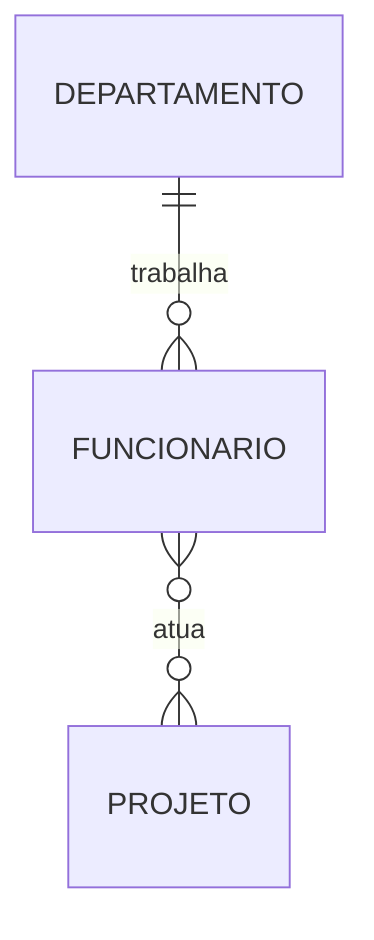
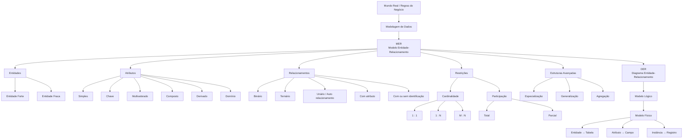

# Aula 002 — Modelagem de Dados com MER e DER

> [!abstract] Em uma frase
> A modelagem de dados representa os elementos do mundo real, suas características e seus relacionamentos antes da implementação física do banco de dados.

> [!info] Continuidade
> Esta aula dá sequência aos fundamentos apresentados em [[Aula 001]].

## Objetivos

- Diferenciar **MER** e **DER**.
- Identificar entidades, atributos, chaves e relacionamentos.
- Compreender atributos multivalorados, compostos e derivados.
- Definir cardinalidades e restrições de participação.
- Reconhecer entidades fortes e fracas.
- Entender relacionamentos binários, ternários e unários.
- Compreender especialização, generalização e agregação.

## MER e DER

O **Modelo Entidade-Relacionamento (MER)** é o conjunto de conceitos e elementos utilizados pelo projetista para representar os dados de um domínio.

O **Diagrama Entidade-Relacionamento (DER)** é a representação gráfica criada a partir do MER.

> [!tip] Resumo
> **MER = conceitos usados para modelar.**  
> **DER = representação gráfica resultante da modelagem.**

## Símbolos básicos

| Elemento | Representação no DER |
|---|---|
| Entidade | Retângulo |
| Entidade fraca | Retângulo duplo |
| Relacionamento | Losango |
| Relacionamento de identificação | Losango duplo |
| Atributo | Elipse |
| Atributo-chave | Elipse com nome sublinhado |
| Atributo multivalorado | Elipse dupla |
| Atributo composto | Elipse ligada a outros atributos |
| Atributo derivado | Elipse tracejada |
| Participação total | Linha dupla |

## Entidades

Uma **entidade** representa um objeto do mundo real existente no negócio sobre o qual desejamos armazenar informações.

Exemplos apresentados no material incluem veículo, funcionário, departamento, produto, projeto, aluno e professor.

Cada ocorrência concreta de uma entidade é uma **instância**.

```text
Entidade: PRODUTO
Instâncias: Produto A, Produto B, Produto C
```

## Atributos

Os **atributos** representam propriedades que descrevem uma entidade.

```text
PRODUTO
├── Código
├── Nome
└── Ano
```

### Chave primária

A **chave primária** identifica de forma única cada ocorrência de uma entidade.

Características apresentadas no material:

- não deve se repetir;
- identifica unicamente cada registro;
- não pode possuir valor nulo.

Exemplos do material incluem o chassi para carros e o RA para alunos.

### Domínio

O **domínio** indica qual tipo de informação um atributo pode armazenar e quais valores são válidos.

Exemplos:

```text
Nome        → VARCHAR(30)
Descricao   → VARCHAR(150)
Quantidade  → Numérico
Data        → DateTime
```

### Atributo multivalorado

Ocorre quando uma mesma instância pode possuir vários valores para um atributo.

No DER, é representado por uma elipse dupla.

### Atributo composto

É formado por outros atributos.

```text
Dimensão
├── Comprimento
├── Largura
└── Altura
```

### Atributo derivado

É obtido a partir de outro atributo ou de algum cálculo.

Um exemplo apresentado é a quantidade de funcionários, obtida a partir das ocorrências existentes.

## Relacionamentos

Um **relacionamento** representa uma associação entre duas ou mais entidades.

```text
EMPREGADO ─── TRABALHA EM ─── DEPARTAMENTO
```

Os relacionamentos normalmente surgem das próprias regras do negócio.

> Um funcionário trabalha em um departamento.

Da frase surgem duas entidades e o relacionamento entre elas.

## Atributo de relacionamento

Uma informação pertence ao relacionamento quando depende da combinação das entidades envolvidas.

```text
ALUNO ─── CURSA ─── DISCIPLINA
             │
            Nota
```

A nota depende da combinação entre aluno e disciplina; portanto, no modelo apresentado, ela é atributo do relacionamento `CURSA`.

Outro exemplo apresentado no material associa a data ao relacionamento de consulta entre médico e paciente.

## Relacionamentos com e sem identificação

### Sem identificação

A entidade pode continuar existindo mesmo sem o relacionamento em questão. No modelo lógico, a chave estrangeira referencia outra tabela, mas não participa da chave primária da tabela que a contém.

### Com identificação

No material, o relacionamento de identificação é representado por losango duplo e está ligado a situações nas quais a existência e a identificação dependem da entidade relacionada. No modelo lógico, a chave estrangeira da entidade proprietária participa da composição da chave primária da tabela dependente.

> [!example] Exemplo lógico
> Em `HISTORICO_REPARO (chassi, seq_reparo, data, tipo, valor)`, `chassi` referencia `CARRO` e, junto com `seq_reparo`, forma a chave primária de `HISTORICO_REPARO`. O reparo é identificado no contexto do carro.

## Grau dos relacionamentos

### Binário

Envolve duas entidades.

```text
CLIENTE ─── COMPRA ─── PRODUTO
```

### Ternário

Envolve três entidades no mesmo relacionamento. O material apresenta um exemplo envolvendo professor, aluno e disciplina.

## Cardinalidade

A **cardinalidade** representa quantas ocorrências de uma entidade podem estar associadas às ocorrências de outra.

Tipos:

- `1 : 1` — um para um;
- `1 : N` — um para muitos;
- `N : 1` — muitos para um;
- `M : N` — muitos para muitos.

### Cardinalidade 1:1

```text
EMPREGADO ─── GERENCIA ─── DEPARTAMENTO
    1                           1
```

No exemplo do material, um departamento pode ser gerenciado por um empregado e um empregado pode gerenciar um departamento.

### Cardinalidade 1:N

```text
DEPARTAMENTO ─── TRABALHA ─── EMPREGADO
      1                            N
```

No exemplo, em um departamento podem trabalhar vários empregados, enquanto cada empregado trabalha em um departamento.

### Cardinalidade M:N

```text
EMPREGADO ─── ATUA ─── PROJETO
     M                     N
```

Um empregado pode atuar em vários projetos e um projeto pode ter vários empregados.

## Cardinalidade mínima e máxima

| Notação | Significado |
|---|---|
| `(0,1)` | participação opcional, no máximo uma ocorrência |
| `(0,N)` | participação opcional, podendo haver várias ocorrências |
| `(1,1)` | participação obrigatória e exatamente uma ocorrência |
| `(1,N)` | participação obrigatória e podendo haver várias ocorrências |

## Restrição de participação

### Participação total

A entidade precisa participar do relacionamento. O exemplo do material afirma que todo empregado deve participar de um departamento.

No DER, a participação total é representada por linha dupla.

### Participação parcial

Nem todas as ocorrências precisam participar do relacionamento. O exemplo apresentado indica que nem todo empregado precisa gerenciar um departamento.

## Entidade forte e entidade fraca

Uma **entidade forte** possui atributos suficientes para formar sua própria chave primária.

Uma **entidade fraca** depende da existência de outra entidade e não possui atributos suficientes para formar sozinha sua identificação completa.

```text
FUNCIONÁRIO
     │
     │ possui
     ▼
DEPENDENTE
```

O material também relaciona um carro ao seu histórico de reparos como exemplo de dependência.

## Relacionamento unário — auto relacionamento

Ocorre quando uma entidade se relaciona com ela mesma.

```text
EMPREGADO ─── SUPERVISIONA ─── EMPREGADO
```

A mesma entidade exerce papéis diferentes no relacionamento: supervisor e supervisionado.

## Especialização e generalização

### Generalização

É o resultado da união de entidades mais específicas em uma entidade de nível mais geral. Enfatiza as semelhanças entre os conjuntos.

### Especialização

É a separação de subconjuntos específicos a partir de uma entidade geral. Enfatiza as diferenças.

```text
             FUNCIONÁRIO
             /          \
            /            \
     SECRETÁRIA       ENGENHEIRO
         │                 │
       idioma             CREA
```

As entidades especializadas herdam os atributos da entidade superior e acrescentam atributos próprios.

## Agregação

A **agregação** é uma abstração em que um relacionamento é tratado como um conjunto de nível mais alto para participar de outro relacionamento.

```text
FUNCIONÁRIO ─── ALOCAÇÃO ─── PROJETO
                     │
                     │ reserva
                     ▼
                  MÁQUINA
```

Nesse exemplo, a reserva está associada à alocação do funcionário em determinado projeto.

Outro exemplo do material relaciona a consulta entre médico e paciente à prescrição de medicamentos.

## Modelo lógico e modelo físico

O material apresenta a seguinte correspondência:

| Modelagem | Implementação no banco |
|---|---|
| Entidade | Tabela |
| Atributo | Campo |
| Ocorrência | Registro |
| Chave primária | Modelo lógico e físico |
| Chave secundária | Indicada no material como modelo físico |

## Processo básico de modelagem

1. **Entender o problema:** ler as regras do negócio.
2. **Identificar as entidades:** localizar os principais objetos do domínio.
3. **Identificar os atributos:** determinar o que descreve cada entidade.
4. **Definir as chaves:** escolher os identificadores únicos.
5. **Identificar relacionamentos:** transformar regras de negócio em associações.
6. **Identificar atributos de relacionamento:** verificar informações que dependem de mais de uma entidade.
7. **Definir cardinalidades:** determinar quantas ocorrências participam de cada lado.
8. **Definir participação:** total ou parcial.
9. **Identificar entidades fracas:** verificar dependências de existência.
10. **Analisar estruturas especiais:** auto relacionamento, especialização, generalização e agregação.

## Exemplo resumido

> Uma empresa possui departamentos. Funcionários trabalham nos departamentos e também podem atuar em projetos.

```text
DEPARTAMENTO 1 ─── N FUNCIONÁRIO
FUNCIONÁRIO  M ─── N PROJETO
```



## Mapa da modelagem de banco de dados



## Mapa rápido para revisão

```text
MODELAGEM DE BANCO DE DADOS
│
├── MER → conceitos de modelagem
├── DER → representação gráfica
├── ENTIDADE
│   ├── Forte
│   └── Fraca
├── ATRIBUTOS
│   ├── Simples
│   ├── Chave
│   ├── Multivalorado
│   ├── Composto
│   ├── Derivado
│   └── Domínio
├── RELACIONAMENTOS
│   ├── Binário
│   ├── Ternário
│   ├── Unário
│   ├── Com atributo
│   └── Com/sem identificação
├── CARDINALIDADE
│   ├── 1:1
│   ├── 1:N
│   └── M:N
├── PARTICIPAÇÃO
│   ├── Total
│   └── Parcial
├── ESPECIALIZAÇÃO / GENERALIZAÇÃO
└── AGREGAÇÃO
```

## Resumo

- **MER:** conjunto de conceitos utilizados para modelar.
- **DER:** representação gráfica da modelagem.
- **Entidade:** objeto do mundo real.
- **Atributo:** característica de uma entidade.
- **Chave primária:** identifica unicamente uma ocorrência.
- **Domínio:** determina os valores permitidos para um atributo.
- **Relacionamento:** associação entre entidades.
- **Cardinalidade:** quantidade de ocorrências envolvidas em um relacionamento.
- **Participação:** indica se a participação é obrigatória ou opcional.
- **Entidade fraca:** depende de outra entidade.
- **Auto relacionamento:** entidade relaciona-se consigo mesma.
- **Especialização/generalização:** representam hierarquias.
- **Agregação:** permite relacionar uma entidade a um relacionamento tratado em nível superior.

```text
Mundo Real
    ↓
Regras do Negócio
    ↓
MER
    ↓
DER
    ↓
Modelo Lógico
    ↓
Modelo Físico
    ↓
Banco de Dados
```

## Material-base

Anotação elaborada a partir do material da aula **“Modelagem de dados utilizando Entidade e Relacionamento”**, de Sandro Roberto Armelin.
