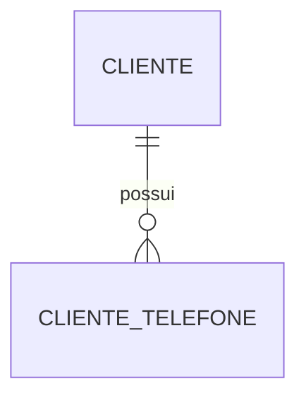
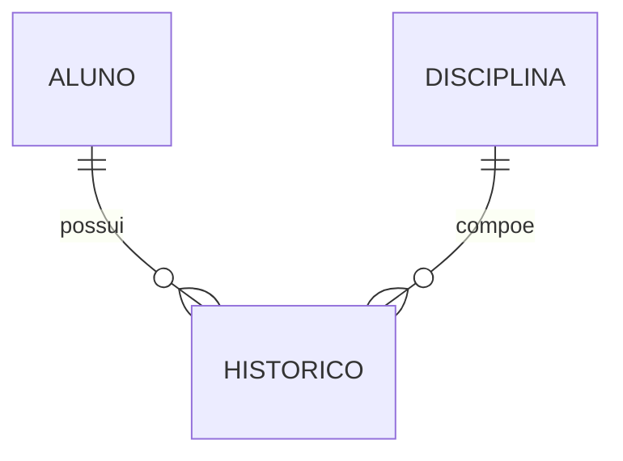
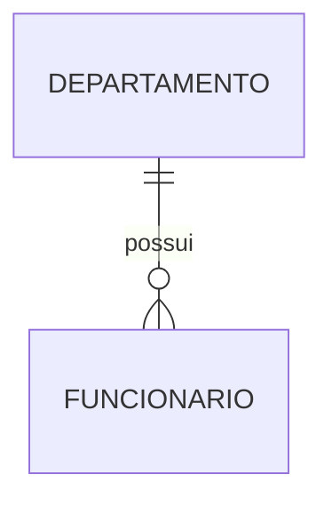

# Aula 003 — Conversão do Modelo Conceitual para o Modelo Lógico

> [!abstract] Em uma frase
> Converter um DER para o modelo lógico significa transformar entidades, atributos e relacionamentos em tabelas, campos, chaves primárias e chaves estrangeiras, preservando as regras do negócio e as cardinalidades.

> [!info] Continuidade
> Esta aula transforma os conceitos de MER e DER estudados em [[Aula 002]] em estruturas do modelo relacional apresentado em [[Aula 001]].

## Objetivos

- Diferenciar os modelos conceitual, lógico e físico.
- Converter entidades e atributos em tabelas e campos.
- Mapear atributos simples, compostos, multivalorados e derivados.
- Converter relacionamentos `1:1`, `1:N` e `N:N`.
- Posicionar corretamente chaves estrangeiras e atributos de relacionamento.
- Converter especializações e generalizações.
- Tratar entidades sem chave primária durante a conversão.
- Validar se o modelo lógico preserva as regras do DER.

## Do mundo real ao banco de dados

O processo de modelagem parte das informações do mundo real e avança por níveis de abstração:

```text
Mundo real e regras do negócio
              ↓
Modelo conceitual — MER/DER
              ↓
Modelo lógico — relações, atributos, PKs e FKs
              ↓
Modelo físico — tipos, índices e detalhes do SGBD
              ↓
Implementação — comandos SQL
```

| Etapa | Pergunta principal | Elementos |
|---|---|---|
| **Modelo conceitual** | Quais objetos e associações existem no domínio? | Entidades, atributos, relacionamentos, cardinalidades e participação. |
| **Modelo lógico** | Como esses elementos serão representados no modelo relacional? | Tabelas, campos, chaves primárias e chaves estrangeiras. |
| **Modelo físico** | Como o SGBD escolhido armazenará e acessará os dados? | Tipos concretos, índices, restrições, nomes físicos e detalhes de implementação. |

> [!important] Conversão não é apenas redesenhar
> O modelo lógico deve conservar a semântica do DER. Uma conversão pode parecer organizada e ainda estar errada se permitir combinações proibidas ou perder cardinalidades, atributos ou dependências.

## Vocabulário da conversão

| Modelo conceitual | Modelo lógico relacional |
|---|---|
| Entidade | Tabela ou relação |
| Atributo | Campo ou coluna |
| Instância/ocorrência | Registro, linha ou tupla |
| Atributo-chave | Chave primária — `PK` |
| Referência entre tabelas | Chave estrangeira — `FK` |
| Domínio | Conjunto de valores permitidos/tipo do atributo |
| Relacionamento | `FK` ou tabela associativa, conforme a cardinalidade |

### Chave primária — PK

A **chave primária** identifica cada registro de maneira única.

- não se repete;
- não aceita valor nulo;
- pode ser simples, com um campo, ou composta, com mais de um campo;
- deve ser estável e mínima: não deve conter campos desnecessários.

### Chave estrangeira — FK

A **chave estrangeira** é um campo, ou conjunto de campos, que referencia a chave primária de outra tabela.

Sua função é materializar uma associação e preservar a **integridade referencial**: um valor de FK deve corresponder a uma PK existente na tabela referenciada, salvo quando a participação for opcional e o campo puder ser nulo.

> [!tip] Regra mental
> A `PK` responde **“qual registro é este?”**. A `FK` responde **“a qual registro de outra tabela este registro está ligado?”**.

## Regras de conversão apresentadas em aula

| Nº | Elemento no DER | Conversão para o modelo lógico |
|---:|---|---|
| 1 | Entidade | Cria uma tabela. |
| 2 | Atributo multivalorado | Cria uma nova tabela ligada por relacionamento `1:N`. |
| 3 | Relacionamento `N:N` | Cria uma tabela associativa e transforma o relacionamento em duas relações `1:N`. |
| 4 | Atributo composto | Seus componentes são detalhados dentro da própria tabela. |
| 5 | Especialização/generalização | Cria uma tabela para cada especialização com relação `1:N`, conforme a regra registrada no quadro. Na implementação de cada subtipo, a chave da entidade geral é propagada para a tabela especializada. |
| 6 | Relacionamento `1:N` | A PK do lado `1` vai para o lado `N` como FK; não se cria tabela para o relacionamento. |
| 7 | Atributo de relacionamento `1:N` | O atributo fica na tabela do lado `N`. |
| 8 | Relacionamento ternário | É convertido em tabela própria, permitindo representar as três associações. |
| 9 | Relacionamento `1:1` | Escolhe-se um dos lados para receber a FK. |
| 10 | Entidade do lado `1` sem PK | Cria-se uma PK antes de propagar a referência. |

> [!note] Sobre especialização/generalização
> Cada ocorrência de uma especialização corresponde a uma única ocorrência da entidade geral, por isso a chave da tabela especializada normalmente é também FK para a tabela geral. O sentido `1:N` anotado no quadro expressa que uma categoria geral pode originar conjuntos de ocorrências especializadas; a ligação individual entre uma linha da superclasse e uma linha de cada subtipo permanece `1:1`.

## Regra 1 — entidade vira tabela

Cada entidade relevante do DER origina uma tabela. Seus atributos simples tornam-se campos, e o atributo identificador torna-se a PK.

```text
DER
ALUNO
├── RA — chave
├── nome
└── data_nascimento

MODELO LÓGICO
ALUNO (
    ra PK,
    nome,
    data_nascimento
)
```

Uma entidade forte já possui atributos suficientes para formar sua chave. Uma entidade fraca depende de outra entidade e normalmente recebe a chave da entidade proprietária como parte de sua identificação.

### Entidade fraca

```text
FUNCIONARIO (
    cod_funcionario PK,
    nome
)

DEPENDENTE (
    cod_funcionario PK, FK → FUNCIONARIO.cod_funcionario,
    seq_dependente   PK,
    nome,
    parentesco
)
```

Nesse exemplo, a PK de `DEPENDENTE` é composta por `cod_funcionario` e `seq_dependente`. O dependente não é identificado de forma completa sem o funcionário.

## Regra 2 — atributo multivalorado cria outra tabela

Um campo relacional deve conter apenas um valor atômico. Portanto, não se deve guardar vários telefones em uma única coluna separando-os por vírgula.

```text
DER
CLIENTE
├── cod_cliente — chave
├── nome
└── telefone — multivalorado
```

```text
CLIENTE (
    cod_cliente PK,
    nome
)

CLIENTE_TELEFONE (
    cod_cliente PK, FK → CLIENTE.cod_cliente,
    telefone    PK
)
```



A nova tabela representa a relação `1:N`: um cliente pode possuir vários telefones, e cada linha de `CLIENTE_TELEFONE` pertence a um cliente.

> [!warning] Erro comum
> `telefone_1`, `telefone_2` e `telefone_3` impõem um limite artificial, produzem campos vazios e dificultam consultas. Uma tabela própria permite qualquer quantidade de ocorrências.

## Regra 3 — relacionamento N:N cria tabela associativa

Uma FK isolada em apenas um dos lados não consegue representar um relacionamento muitos para muitos. Cria-se uma **tabela associativa**, também chamada de tabela de junção.

### Exemplo: alunos cursam disciplinas

```text
DER
ALUNO N ─── CURSA ─── N DISCIPLINA
                    nota
                    frequencia
                    semestre
                    ano
```

```text
ALUNO (
    ra PK,
    nome
)

DISCIPLINA (
    cod_disciplina PK,
    titulo,
    carga_horaria
)

HISTORICO (
    ra             PK, FK → ALUNO.ra,
    cod_disciplina PK, FK → DISCIPLINA.cod_disciplina,
    semestre       PK,
    ano            PK,
    nota,
    frequencia
)
```



O relacionamento `N:N` foi decomposto em dois relacionamentos `1:N`:

- `ALUNO 1:N HISTORICO`;
- `DISCIPLINA 1:N HISTORICO`.

Os atributos `nota` e `frequencia` dependem da combinação aluno-disciplina em determinado semestre e ano. Por isso pertencem à tabela associativa, e não a `ALUNO` ou `DISCIPLINA`.

### Chave da tabela associativa

A combinação das FKs frequentemente forma a PK da tabela associativa. Quando a mesma combinação puder ocorrer mais de uma vez, acrescentam-se os atributos necessários à identificação.

No histórico escolar, um aluno pode cursar novamente a mesma disciplina. Assim, apenas `(ra, cod_disciplina)` não seria suficiente; `semestre` e `ano` distinguem as tentativas.

## Regra 4 — atributo composto é detalhado na própria tabela

Um atributo composto é decomposto nos campos simples que realmente armazenam valores.

```text
DER
FUNCIONARIO
├── matricula — chave
├── nome
└── endereco — composto
    ├── rua
    ├── numero
    ├── bairro
    └── cep
```

```text
FUNCIONARIO (
    matricula PK,
    nome,
    rua,
    numero,
    bairro,
    cep
)
```

Não é necessário criar uma tabela `ENDERECO` apenas porque o atributo é composto. A nova tabela só se justifica se endereço tiver identidade própria, for compartilhado, tiver várias ocorrências ou se as regras do negócio exigirem seu tratamento como entidade.

> [!important] Composto não é multivalorado
> Um endereço formado por rua, número, bairro e CEP é **composto**. Vários endereços pertencentes à mesma pessoa caracterizam também uma ocorrência **multivalorada**, exigindo outra tabela.

## Regra 5 — especialização e generalização

Na especialização, uma entidade geral, ou superclasse, reúne atributos comuns; as entidades especializadas, ou subclasses, herdam esses atributos e possuem atributos próprios.

```text
             FUNCIONARIO
             /          \
            /            \
       MOTORISTA       ENGENHEIRO
         cnh          crea, formacao
```

```text
FUNCIONARIO (
    cod_funcionario PK,
    nome,
    endereco
)

MOTORISTA (
    cod_funcionario PK, FK → FUNCIONARIO.cod_funcionario,
    numero_cnh,
    validade_cnh
)

ENGENHEIRO (
    cod_funcionario PK, FK → FUNCIONARIO.cod_funcionario,
    crea,
    formacao
)
```

Os atributos comuns ficam apenas em `FUNCIONARIO`. Cada especialização reutiliza a mesma chave da ocorrência geral; essa chave é simultaneamente PK da especialização e FK para `FUNCIONARIO`.

### Restrições que precisam ser preservadas

- **Total ou parcial:** todo funcionário precisa pertencer a algum subtipo ou pode existir apenas na superclasse?
- **Disjunta ou sobreposta:** um funcionário pode pertencer a somente um subtipo ou a vários?

Essas restrições fazem parte da regra do negócio e podem exigir validações adicionais na implementação física.

## Regra 6 — relacionamento 1:N leva a PK do lado 1 para o lado N

No relacionamento `1:N`, a PK da tabela do lado `1` é copiada para a tabela do lado `N` como FK. Não se cria uma tabela apenas para o relacionamento.

### Exemplo: departamento e funcionário

```text
DER
DEPARTAMENTO 1 ─── TRABALHA EM ─── N FUNCIONARIO
```

```text
DEPARTAMENTO (
    cod_departamento PK,
    nome
)

FUNCIONARIO (
    cod_funcionario  PK,
    nome,
    cod_departamento FK → DEPARTAMENTO.cod_departamento
)
```



> [!tip] Frase para memorizar
> No `1:N`, a chave **viaja do lado 1 para o lado N**.

### Participação e nulidade

- Se todo funcionário deve pertencer a um departamento, a FK é obrigatória: `NOT NULL` no modelo físico.
- Se um funcionário pode ainda não estar alocado, a FK pode ser nula.

A cardinalidade mínima do DER orienta essa decisão.

## Regra 7 — atributo do relacionamento 1:N fica no lado N

Quando o relacionamento `1:N` possui atributos próprios, eles são levados para a tabela do lado `N`, junto com a FK.

```text
DER
DEPARTAMENTO 1 ─── ALOCA ─── N FUNCIONARIO
                     │
                data_ingresso
```

```text
FUNCIONARIO (
    cod_funcionario  PK,
    nome,
    cod_departamento FK → DEPARTAMENTO.cod_departamento,
    data_ingresso
)
```

`data_ingresso` não descreve todo departamento e também não existe isoladamente para o funcionário: descreve a alocação do funcionário naquele departamento. Como cada funcionário se liga a apenas um departamento nesse modelo, o atributo pode ficar do lado `N`.

> [!warning] Verifique o histórico
> Se o funcionário puder atuar em vários departamentos ao longo do tempo, o relacionamento real deixa de ser um simples `1:N` atual. Para preservar todas as alocações, cria-se uma tabela própria com departamento, funcionário, data de ingresso e data de saída.

## Regra 8 — relacionamento ternário cria tabela

Um relacionamento ternário associa simultaneamente três entidades. Sua semântica não deve ser substituída automaticamente por três relacionamentos binários, pois isso pode permitir combinações que não ocorreram juntas.

### Exemplo: funcionário vende produto para cliente

```text
VENDA (
    cod_venda       PK,
    cod_funcionario FK → FUNCIONARIO.cod_funcionario,
    cod_produto     FK → PRODUTO.cod_produto,
    cod_cliente     FK → CLIENTE.cod_cliente,
    data_hora,
    quantidade,
    valor
)
```

A linha de `VENDA` registra uma ocorrência completa: qual funcionário vendeu qual produto para qual cliente, em determinada data e quantidade.

## Regra 9 — relacionamento 1:1 escolhe um lado para receber a FK

Em um relacionamento `1:1`, uma das tabelas recebe a PK da outra como FK. Essa FK deve possuir restrição de unicidade para impedir que várias linhas apontem para a mesma ocorrência.

```text
PESSOA (
    cpf PK,
    nome
)

PASSAPORTE (
    numero_passaporte PK,
    data_validade,
    cpf FK UNIQUE → PESSOA.cpf
)
```

### Como escolher o lado

Prefira colocar a FK:

- no lado de participação total, reduzindo valores nulos;
- no lado que depende da existência do outro;
- no lado que produz nomes e consultas mais claros;
- onde a regra de negócio possa ser garantida com menos restrições adicionais.

Se toda passagem de `PASSAPORTE` depende de uma pessoa, mas nem toda pessoa possui passaporte, a FK em `PASSAPORTE` representa melhor a dependência.

> [!warning] Apenas a FK não garante 1:1
> Sem `UNIQUE`, várias linhas de `PASSAPORTE` poderiam referenciar a mesma pessoa, transformando o modelo físico em `1:N`.

## Regra 10 — entidade sem PK precisa receber uma chave

Para que uma tabela seja referenciada por FK, ela precisa possuir uma chave candidata identificável, normalmente definida como PK no modelo lógico.

```text
ANTES
CIDADE (
    nome,
    estado
)
```

`nome` sozinho não identifica uma cidade de maneira segura. Deve-se escolher uma chave natural composta ou criar um identificador.

```text
CIDADE (
    cod_cidade PK,
    nome,
    uf
)

ENDERECO (
    cod_endereco PK,
    logradouro,
    cod_cidade FK → CIDADE.cod_cidade
)
```

> [!important] A PK deve existir antes da FK
> A FK copia os campos de uma chave candidata da tabela referenciada. Sem identificador único no lado `1`, não há como declarar qual ocorrência será referenciada.

## Relacionamento com e sem identificação

Os slides distinguem dois casos conforme o papel da FK na identificação da tabela dependente.

### Relacionamento sem identificação

A FK referencia outra tabela, mas **não participa da PK** da tabela que a contém.

```text
LIVRO (
    isbn PK,
    titulo,
    cpf_proprietario FK → PESSOA.cpf
)
```

O livro mantém sua identidade pelo `isbn`, mesmo que mude de proprietário.

### Relacionamento com identificação

A FK participa da composição da PK da tabela dependente.

```text
HISTORICO_REPARO (
    chassi       PK, FK → CARRO.chassi,
    seq_reparo   PK,
    data,
    tipo,
    valor
)
```

O reparo é identificado no contexto do carro. Sem a chave do carro, sua identificação fica incompleta.

## Atributos derivados

Atributos derivados são calculados a partir de outros dados, como idade a partir da data de nascimento ou quantidade de funcionários a partir das linhas existentes.

Em geral, não são armazenados no modelo lógico quando podem ser calculados com segurança:

```text
PESSOA (
    cpf PK,
    nome,
    data_nascimento
)

idade = calculada a partir de data_nascimento
```

Armazenar `idade` provocaria inconsistência com o passar do tempo. Em alguns sistemas, um valor derivado pode ser materializado por desempenho, mas então é necessário definir como ele será atualizado.

## Auto relacionamento

Quando uma entidade se relaciona consigo mesma, a FK aponta para a própria tabela e os papéis devem receber nomes claros.

```text
EMPREGADO (
    cod_empregado  PK,
    nome,
    cod_supervisor FK → EMPREGADO.cod_empregado
)
```

Esse modelo representa `EMPREGADO 1:N EMPREGADO`: um supervisor pode supervisionar vários empregados, e cada empregado possui no máximo um supervisor.

Para um auto relacionamento `N:N`, cria-se uma tabela associativa com duas FKs para a mesma tabela, nomeadas conforme os papéis.

## Agregação

A agregação trata um relacionamento como um conjunto de nível mais alto para que ele participe de outro relacionamento.

No exemplo dos slides, a alocação de um funcionário em um projeto pode reservar uma máquina. A reserva não depende apenas do funcionário ou apenas do projeto; depende da alocação específica.

```text
ALOCACAO (
    cpf_funcionario PK, FK → FUNCIONARIO.cpf,
    cod_projeto     PK, FK → PROJETO.cod_projeto,
    data_inicio,
    data_fim
)

RESERVA (
    cpf_funcionario PK,
    cod_projeto     PK,
    cod_maquina     PK, FK → MAQUINA.cod_maquina,
    data            PK,
    hora,
    periodo,
    FK (cpf_funcionario, cod_projeto) → ALOCACAO
)
```

A FK composta em `RESERVA` garante que a reserva esteja ligada a uma alocação existente.

## Exemplo integrado — universidade

### Regras do negócio

- A universidade cadastra alunos por RA, nome, endereço, telefone e data de nascimento.
- Disciplinas possuem código, título, descrição e carga horária.
- O histórico associa alunos às disciplinas cursadas em cada semestre e ano.
- Para cada ocorrência, são armazenadas nota e frequência.
- Um aluno pode possuir vários telefones.
- O endereço é composto por logradouro, número, bairro, cidade e CEP.

### Modelo lógico resultante

```text
ALUNO (
    ra              PK,
    nome,
    data_nascimento,
    logradouro,
    numero,
    bairro,
    cidade,
    cep
)

ALUNO_TELEFONE (
    ra       PK, FK → ALUNO.ra,
    telefone PK
)

DISCIPLINA (
    cod_disciplina PK,
    titulo,
    descricao,
    carga_horaria
)

HISTORICO (
    ra             PK, FK → ALUNO.ra,
    cod_disciplina PK, FK → DISCIPLINA.cod_disciplina,
    semestre       PK,
    ano            PK,
    nota,
    frequencia
)
```

### Decisões aplicadas

1. `ALUNO` e `DISCIPLINA` viraram tabelas.
2. O endereço composto foi detalhado dentro de `ALUNO`.
3. O telefone multivalorado originou `ALUNO_TELEFONE`.
4. O relacionamento `N:N` entre aluno e disciplina originou `HISTORICO`.
5. Nota e frequência ficaram em `HISTORICO`, pois dependem da associação.
6. Semestre e ano participam da PK para permitir que a disciplina seja cursada novamente.

## Roteiro de conversão

1. Liste todas as entidades do DER.
2. Crie uma tabela para cada entidade.
3. Defina uma PK para cada tabela.
4. Converta atributos simples em campos.
5. Decomponha atributos compostos dentro da tabela.
6. Crie tabelas próprias para atributos multivalorados.
7. Avalie atributos derivados antes de armazená-los.
8. Converta relacionamentos `1:N`, propagando a PK do lado `1` para o lado `N`.
9. Leve atributos de relacionamento `1:N` para o lado `N`.
10. Converta relacionamentos `N:N` em tabelas associativas.
11. Converta relacionamentos ternários em tabelas próprias.
12. Escolha o lado adequado para a FK dos relacionamentos `1:1` e aplique unicidade.
13. Converta entidades fracas e relacionamentos de identificação com PKs compostas quando necessário.
14. Converta especializações, mantendo a chave da entidade geral nas tabelas especializadas.
15. Verifique cardinalidade mínima, nulidade, unicidade e integridade referencial.
16. Teste o modelo com exemplos reais das regras do negócio.

## Checklist de validação

> [!check] Antes de considerar o modelo concluído
> - Toda tabela possui uma PK?
> - Toda entidade do DER foi representada?
> - Todo atributo necessário aparece exatamente no lugar em que faz sentido?
> - Atributos compostos foram decompostos?
> - Atributos multivalorados ganharam tabela própria?
> - Relacionamentos `1:N` possuem a FK no lado `N`?
> - Relacionamentos `N:N` e ternários ganharam tabela associativa?
> - Atributos de relacionamento foram colocados na tabela correta?
> - Relacionamentos `1:1` possuem FK com unicidade?
> - Entidades fracas conservam a dependência de identificação?
> - Especializações herdam a PK da entidade geral?
> - FKs opcionais e obrigatórias respeitam a cardinalidade mínima?
> - O modelo permite todos os casos válidos e impede os inválidos?

## Erros comuns

- Colocar uma lista de valores dentro de um único campo.
- Criar `telefone_1`, `telefone_2` e `telefone_3` para um atributo multivalorado.
- Tentar representar `N:N` com uma FK em apenas uma das tabelas.
- Criar tabela desnecessária para todo relacionamento `1:N`.
- Colocar a FK no lado `1` de um relacionamento `1:N`.
- Deixar atributos do relacionamento `N:N` em uma das entidades.
- Esquecer `UNIQUE` na FK que deve representar `1:1`.
- Referenciar uma tabela que não possui chave identificadora.
- Copiar os atributos comuns para todas as especializações, gerando redundância.
- Armazenar atributo derivado sem mecanismo que preserve sua consistência.
- Ignorar cardinalidade mínima ao definir se uma FK aceita valor nulo.
- Substituir um relacionamento ternário por relações binárias sem verificar a semântica.

## Mapa rápido para revisão

```text
DER                         MODELO LÓGICO
│
├── Entidade                → tabela
├── Atributo simples        → campo
├── Atributo composto       → campos componentes na mesma tabela
├── Atributo multivalorado  → nova tabela + FK
├── Atributo derivado       → geralmente calculado
├── Relacionamento 1:N      → FK no lado N
│   └── com atributo        → atributo no lado N
├── Relacionamento N:N      → tabela associativa + duas FKs
├── Relacionamento ternário → tabela própria + três FKs
├── Relacionamento 1:1      → FK UNIQUE em um dos lados
├── Entidade fraca          → PK inclui a PK da entidade proprietária
├── Especialização          → tabela por subtipo; PK também é FK
└── Auto relacionamento     → FK aponta para a própria tabela
```

## Revisão ativa

> [!question] Perguntas
> - Qual é a diferença entre modelo conceitual, lógico e físico?
> - Por que um atributo multivalorado precisa de outra tabela?
> - Para qual lado a chave deve migrar em um relacionamento `1:N`?
> - Por que não se cria normalmente uma tabela para um relacionamento `1:N`?
> - Como um relacionamento `N:N` é transformado em dois relacionamentos `1:N`?
> - Onde ficam os atributos de um relacionamento `N:N`?
> - Onde ficam os atributos de um relacionamento `1:N`?
> - Como garantir que uma FK represente `1:1`, e não `1:N`?
> - Por que uma tabela referenciada precisa possuir uma PK ou chave candidata?
> - Como uma entidade fraca é identificada no modelo lógico?
> - Como as tabelas especializadas se ligam à tabela geral?
> - Quando um atributo derivado deve ser calculado em vez de armazenado?
> - Por que um relacionamento ternário não deve ser decomposto automaticamente?
> - Como a cardinalidade mínima influencia a nulidade de uma FK?

## Materiais

- Slides: **“Banco de Dados”**, de Sandro Roberto Armelin.
- Slides: **“Modelagem de dados utilizando Entidade e Relacionamento”**, de Sandro Roberto Armelin.
- Regras de conversão do modelo conceitual para o modelo lógico registradas no quadro durante a aula.

---

[[01 - Painel/00 - Início|Início]] · [[Aula 001|Aula anterior: Fundamentos]] · [[Aula 002|Aula anterior: MER e DER]]
