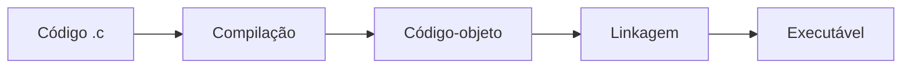

# Aula 001 - Introdução à Linguagem C

> [!abstract] Em uma frase
> A linguagem C transforma algoritmos em programas eficientes por meio de funções, tipos explícitos, operadores e comandos de entrada e saída.

## Objetivos

Ao final desta aula, você deve conseguir:

- explicar a origem e as principais características de C;
- reconhecer as quatro fases do desenvolvimento de um programa;
- escrever, compilar e executar um programa básico;
- escolher tipos adequados e declarar variáveis válidas;
- usar `printf`, `scanf`, `sizeof`, operadores e conversões de tipo;
- resolver pequenos problemas com números e caracteres.

## Materiais incorporados

- **LP_001:** história da linguagem C, modularidade, ciclo de desenvolvimento, anatomia de um programa, sequências de escape e comentários.
- **LP_002:** tipos, modificadores, identificadores, variáveis, operadores, entrada e saída, `sizeof`, caracteres e conversões.

## Da lógica ao programa em C

C foi criada em 1972 por **Dennis Ritchie**, nos Bell Labs, para apoiar o desenvolvimento do sistema operacional Unix. Ela evoluiu da linguagem B, criada por **Ken Thompson**.

### Características importantes

| Característica | Significado prático |
|---|---|
| Desempenho | Permite código próximo do hardware e costuma gerar programas rápidos. |
| Simplicidade | Possui um conjunto relativamente pequeno de palavras reservadas e operadores. |
| Portabilidade | Um programa escrito conforme o padrão pode ser compilado em diferentes plataformas com poucas alterações. |
| Modularidade | Funções e arquivos separam responsabilidades e facilitam manutenção e reaproveitamento. |
| Controle | O programador trabalha explicitamente com tipos, memória e representação dos dados. |
| Influência | C fundamentou ou influenciou linguagens como C++, Java e muitas outras. |

> [!note] C e C++ não são a mesma linguagem
> C é principalmente procedural. C++ começou como uma extensão de C e acrescentou recursos como classes, herança, polimorfismo, sobrecarga e a Standard Template Library (STL).

## Modularidade

Um sistema grande pode ser dividido em módulos menores e independentes. Um módulo de clientes, por exemplo, pode separar as operações de inserir, validar, alterar e excluir.

Essa separação melhora:

- organização;
- reutilização;
- teste;
- leitura;
- manutenção.

Em C, a modularidade costuma ser implementada com **funções** e **arquivos separados**.

## Ciclo de desenvolvimento

1. **Edição:** o código-fonte é escrito em um arquivo, geralmente com extensão `.c`.
2. **Compilação:** o compilador traduz e verifica o código, gerando código-objeto.
3. **Linkagem:** o linker reúne os objetos e as bibliotecas necessárias em um executável.
4. **Execução:** o sistema operacional carrega e inicia o programa.



## Anatomia de um programa

Um programa em C é formado por uma ou mais funções. A função `main` é o ponto de entrada: a execução começa nela.

```c
#include <stdio.h>

int main(void) {
    printf("Olá, mundo!\n");
    return 0;
}
```

| Trecho | Função |
|---|---|
| `#include <stdio.h>` | Disponibiliza funções de entrada e saída, como `printf` e `scanf`. |
| `int main(void)` | Declara a função principal, sem parâmetros, retornando um inteiro. |
| `{` e `}` | Delimitam o bloco de comandos da função. |
| `printf(...)` | Exibe texto formatado no console. |
| `return 0;` | Encerra a função informando sucesso ao sistema operacional. |

> [!important] C diferencia maiúsculas de minúsculas
> `main`, `Main` e `MAIN` são identificadores diferentes. As palavras reservadas da linguagem são escritas em minúsculas.

## Strings e sequências de escape

Uma string é delimitada por aspas duplas. Para representar caracteres especiais dentro dela, usa-se a barra invertida `\`.

```c
printf("Ela disse: \"A prática leva à perfeição.\"\n");
```

| Sequência | Representa |
|---|---|
| `\\` | Barra invertida |
| `\'` | Aspas simples |
| `\"` | Aspas duplas |
| `\n` | Nova linha |
| `\r` | Retorno de carro |
| `\t` | Tabulação horizontal |
| `\b` | Retrocesso |
| `\f` | Avanço de página |
| `\a` | Sinal sonoro |
| `\v` | Tabulação vertical |
| `\0` | Caractere nulo |

## Comentários

Comentários documentam o código e são ignorados pelo compilador.

```c
// Comentário de uma linha

/* Comentário
   com várias linhas */
```

## Tipos de dados básicos

Os tipos determinam como um valor é representado, quanto espaço ele ocupa e quais operações pode receber.

| Tipo | Uso típico | Exemplo | Formato comum |
|---|---|---|---|
| `char` | Um caractere ou um pequeno inteiro | `'A'` | `%c` |
| `int` | Números inteiros | `42` | `%d` |
| `float` | Número real de precisão simples | `3.14f` | `%f` |
| `double` | Número real de precisão dupla | `3.14159` | `%f` no `printf`, `%lf` no `scanf` |
| `void` | Ausência de valor ou de parâmetros | `main(void)` | - |

> [!warning] Tamanhos dependem da implementação
> É comum encontrar `char` com 1 byte, `int` e `float` com 4 bytes e `double` com 8 bytes, mas o padrão C não fixa todos esses tamanhos. Use `sizeof` quando a dimensão realmente importar.

### Modificadores

Os modificadores ajustam alcance ou sinal de alguns tipos:

- `signed` e `unsigned` controlam a representação com ou sem sinal;
- `short` pode reduzir o alcance de um inteiro;
- `long` pode ampliar um inteiro e também modificar `double`;
- combinações comuns incluem `unsigned int`, `long int`, `long long int` e `long double`.

```c
unsigned int quantidade = 120U;
long int populacao = 123456789L;
long long int distancia = 12345678901234567LL;
```

## Identificadores e variáveis

Um identificador nomeia variáveis, funções e outros elementos definidos pelo programador.

### Regras de nomes

- começar com letra ou `_`;
- continuar com letras, dígitos ou `_`;
- não usar uma palavra reservada de C;
- respeitar a diferença entre maiúsculas e minúsculas;
- preferir nomes que revelem a finalidade do dado.

```c
int contador;
double salarioMensal;
char primeiraLetra;
```

Uma variável associa **nome**, **tipo**, **endereço de memória** e **valor**. Ela deve ser declarada antes do uso.

```c
int idade = 19;
float salario = 2500.0f;
char primeiraLetra = 'V';
double saldoBancario = 150.75;
```

> [!warning] Inicialize antes de ler
> Uma variável local não inicializada tem valor indeterminado. Usá-la antes de atribuir um valor produz comportamento imprevisível.

## Operadores aritméticos

Considere `a = 21` e `b = 4`:

| Operador | Operação | Exemplo | Resultado |
|---|---|---|---:|
| `+` | Adição | `a + b` | 25 |
| `-` | Subtração | `a - b` | 17 |
| `*` | Multiplicação | `a * b` | 84 |
| `/` | Divisão inteira | `a / b` | 5 |
| `%` | Resto da divisão inteira | `a % b` | 1 |
| `++` | Incremento | `a++` | aumenta `a` em 1 |
| `--` | Decremento | `a--` | diminui `a` em 1 |

> [!tip] Divisão inteira
> Quando os dois operandos são inteiros, a parte decimal é descartada. Para obter `5.25`, use ao menos um operando real, como `(double) a / b`.

## Saída com printf

`printf` escreve dados formatados no console.

```c
int idade = 19;
double media = 8.75;

printf("Idade: %d\n", idade);
printf("Média: %.2f\n", media);
```

Formatos iniciais:

- `%d`: inteiro com sinal;
- `%u`: inteiro sem sinal;
- `%ld`: `long int`;
- `%lld`: `long long int`;
- `%f`: número real no `printf`;
- `%c`: caractere;
- `%s`: string.

## Entrada com scanf

`scanf` lê dados formatados. O operador `&` fornece o endereço da variável que receberá o valor.

```c
int idade;
double raio;

printf("Digite sua idade: ");
scanf("%d", &idade);

printf("Digite o raio: ");
scanf("%lf", &raio);
```

Para ler caracteres e ignorar uma quebra de linha pendente, um espaço antes de `%c` é útil:

```c
char primeiro, segundo;

scanf(" %c", &primeiro);
scanf(" %c", &segundo);
printf("Você digitou '%c' e '%c'.\n", primeiro, segundo);
```

`getchar()` é outra opção para ler um caractere e retorna um `int`, permitindo também representar `EOF`.

## Operador sizeof

`sizeof` informa o tamanho, em bytes, de um tipo ou objeto. O resultado tem tipo `size_t`.

```c
printf("int: %zu bytes\n", sizeof(int));
printf("double: %zu bytes\n", sizeof(double));
```

## Literais inteiros

```c
unsigned int semSinal = 123U;
long int longo = 123456789L;
long long int muitoLongo = 12345678901234567LL;
int octal = 0123;       // 83 em decimal
int hexadecimal = 0x1A3; // 419 em decimal
```

## Números reais e biblioteca matemática

As operações `+`, `-`, `*` e `/` também trabalham com números reais. A biblioteca `<math.h>` oferece funções como:

- `sqrt(x)`: raiz quadrada;
- `pow(x, y)`: potência;
- `sin(x)`, `cos(x)` e `tan(x)`: trigonometria;
- `log(x)` e `exp(x)`: logaritmo natural e exponencial.

### Exemplo: círculo

```c
#include <stdio.h>

#define PI 3.14159265358979323846

int main(void) {
    double raio, area, perimetro;

    printf("Digite o raio da circunferência: ");
    scanf("%lf", &raio);

    area = PI * raio * raio;
    perimetro = 2.0 * PI * raio;

    printf("Área: %.2f\n", area);
    printf("Perímetro: %.2f\n", perimetro);
    return 0;
}
```

## Tipo `char`

`char` ocupa exatamente 1 byte em C e armazena um valor inteiro que pode representar um caractere. Em sistemas baseados em ASCII:

```c
char letra = 'A';
printf("Caractere: %c | código: %d\n", letra, letra);
```

> [!note] Caractere não é string
> `'A'` representa um caractere; `"A"` representa uma string terminada pelo caractere nulo `\0`.

## Conversão explícita (`cast`)

Um cast solicita a conversão de um valor para outro tipo.

```c
float numero = 3.14f;
int inteiro = (int) numero; // resultado: 3
```

O cast não arredonda: na conversão de real para inteiro, a parte fracionária é descartada.

## Exercícios - Material 001

### 1. Olá, mundo com nova linha

Escreva um programa que imprima `Olá, Mundo!` seguido de uma nova linha.

### 2. Aspas no meio

Exiba exatamente:

```text
Ela disse: "A prática leva à perfeição."
```

Use a sequência de escape adequada para as aspas duplas.

### 3. Tabs e espaços

Produza a estrutura abaixo usando `\t`:

```text
Nome:      [Seu nome]
Matrícula: [Número de matrícula]
Curso:     [Nome do curso]
```

## Exercícios - Material 002

### 4. Tamanho dos tipos

Imprima com `sizeof` o tamanho de `char`, `int`, `float`, `double` e `long double`.

### 5. Área e perímetro de um círculo

Leia o raio e calcule área e perímetro. Mostre os resultados com duas casas decimais.

### 6. Leitura de caracteres

Leia dois caracteres com `scanf` e mostre ambos entre aspas simples.

### 7. Conversão de tipo

1. Leia um inteiro.
2. Converta-o para `float`.
3. Multiplique por `0.5`.
4. Converta o resultado para `int`.
5. Exiba o valor final e explique se houve perda de informação.

## Revisão ativa

> [!question] Perguntas
> - Qual é a função das etapas de compilação e linkagem?
> - Por que `int main(void)` é preferível a apenas `main()`?
> - Qual é a diferença entre `%f` e `%lf` no `scanf`?
> - O que acontece em uma divisão entre dois inteiros?
> - Por que uma variável local deve ser inicializada antes do uso?
> - Em que situação um cast pode perder informação?

## Referências

- DAMAS, Luís. *Linguagem C*. LTC, 2007.
- SCHILDT, Herbert. *C completo e total*. 3. ed. Pearson, 1997.
- Materiais 001 e 002 da disciplina de Linguagem de Programação.

---

[[01 - Painel/00 - Início|Início]] · [[01 - Painel/Segundo Semestre|Segundo semestre]] · [[semestre-2/LP - Linguagem de Programação I/00 - Linguagem de Programação I|Mapa de LP I]]
